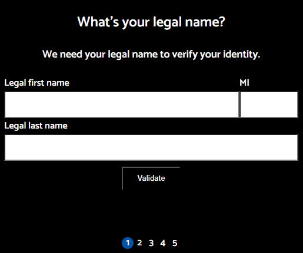
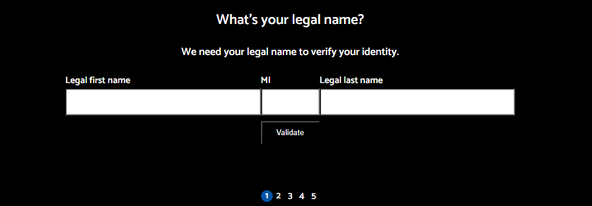

# Credit Card Apply Wizard

## Description
  
  The Credit Card Apply Wizard is a user-friendly web application designed to guide users through the process of applying for a credit card. Utilizing a wizard flow, the application breaks down the application process into easy-to-follow steps, presented as slides.

This application comes with built-in HTML5 validation for form inputs, including support for date validation and custom patterns.

### Mobile View

### Larger Screen View

  
## Application Features

- **Responsive Design:** Utilizes breakpoints for screen adaptability. Navigation buttons remain fixed for ease of use.
  
- **Navigation Animations:** Seamless transition between steps using "Back" and "Forward" buttons.
  
- **Personalization:** Incorporates the customer's name for a tailored experience during the application process.
  
- **Date of Birth Input:** Conveniently defaults to today's date 18 years ago.
  
- **Validation:** Provides client-side prompts for incomplete or incorrect inputs.
  
- **Progress Indicator:** Tracks progress through the application process.
  
- **strings.json:** Centralizes all strings in a single JSON file, simplifying management and updates.
  
- **Localization and Internationalization:** Facilitates translation and localization efforts, enhancing accessibility and user experience.
  
## Future Enhancements

- **Combined Buttons:** Streamline user interaction by merging the "validate" and "forward" buttons.
- **Close Modal Icon:** Add a close icon ('x') to each step and confirm closure with a modal.
- **Animations:** Implement animations for successful actions and smoother step transitions.
- **Step Indicator Styling:** Enhance step indicator CSS to visually represent different states (error, info, success).

## License

This project is licensed under the Apache License 2.0. **While the license allows usage, modification, and distribution, explicit consent is required for any use of this code outside the terms specified in the license. Unauthorized copying or usage is prohibited.**

For full license details, see the [LICENSE](https://spdx.org/licenses/Apache-2.0.html) file.

## Installation
  
  git clone git@github.com:bravotango/credit-card-apply.git

## Questions

  Repository owner:
  [https://github.com/bravotango](https://github.com/bravotango)

  Repository email: 
  <a href="mailto:brian.tracy@btgraphix.com">brian.tracy@btgraphix.com</a>

## NextJs

Server-Side Rendering (SSR) with Next.js

- Generating HTML content on the server before sending it to the client's browser. 
- SSR offers SEO benefits, faster initial page loads, and improved support for users on slow connections.

Next.js allows you to render pages on the server before sending them to the client's browser. When a user requests a page, the server generates the HTML content dynamically, including any data fetched from external sources or APIs. This pre-rendered HTML is then sent to the client, where it is displayed to the user. SSR offers several advantages, including improved search engine optimization (SEO), faster initial page loads, and better support for users with slow internet connections or devices.

Client-Side Rendering (CSR) with Next.js:

In addition to server-side rendering, Next.js also supports client-side rendering, where pages are rendered directly in the user's browser using JavaScript. With CSR, the initial page load consists of a minimal HTML shell, followed by JavaScript execution that fetches data and renders the page dynamically. This approach offers greater interactivity and flexibility, as pages can be updated without reloading the entire page. However, CSR may result in slower initial page loads, especially for content-heavy applications or pages with complex UI components.

Next.js provides developers with the flexibility to choose between server-side rendering, client-side rendering, or a hybrid approach based on the specific requirements of their project. This flexibility enables developers to optimize rendering performance and deliver a seamless user experience tailored to their application's needs.

